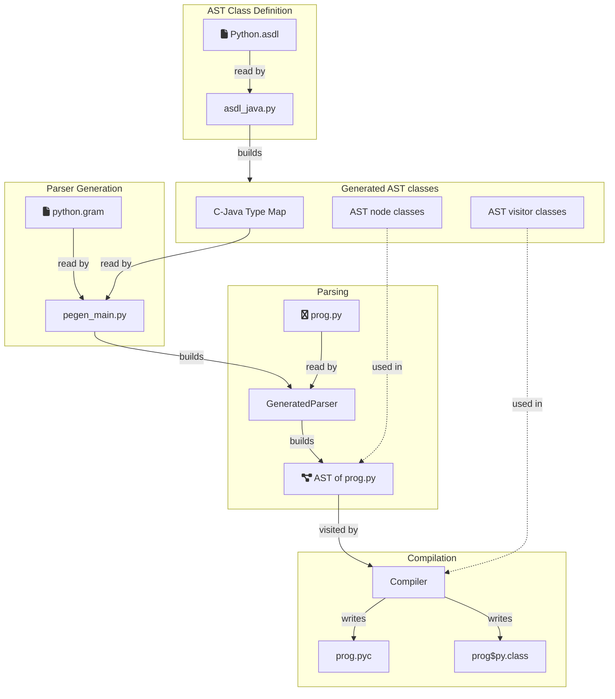

# A Visual Guide to Source Generation 

The purpose of the generated parser is to create an abstract syntax tree (AST)
whenever we have to compile Python source code.
The AST will be read by a second phase of compilation
(not part of the original Pegen2 project)
to generate Python byte code or a JVM class file.
The AST also has a variety of uses in its own right.

This run-time capability is enabled by several build-time processes.
We can trace the dependencies between the elements of this design
in the following diagram.
The arbitrary code compiled at run-time is represented here by `prog.py`.

These phases, parsing and compilation,
will run for each compilation unit (module) we need to execute.
Before that, two preparatory steps are necessary,
shown here as "Parser Generation" and "AST Class Definition".
These are one-time actions
carried out in the build phase of an application.

In Parser Generation,
the PEG compiler reads an augmented grammar of Python
and creates the generated parser as Java source code.

In AST Class Definition,
we read a data description of the AST nodes,
given in a compact notation ASDL.
We generate Java classes that represent the AST nodes
and the base classes of visitors to be used by applications,
including the second phase of the compiler,
that pass over the AST to collect symbols or generate code.
The node classes generated here are also the Python objects
exported by the `ast` module.

## Parser Action Translation

The grammar of Python we use in Parser Generation (`python.gram`),
is taken verbatim from the reference implementation CPython.
It contains actions to build an AST
that contribute to the text of the generated parser,
but they are written in C by the CPython developers.

The Pegen2 project contained a mechanism to translate
these actions from C to Java in code supporting `pegen/__main__.py`,
but it was not wholly successful at the last look.
For this purpose, `asdl_java.py` creates a mapping
from C struct names to Java constructors,
when it generates the node classes themselves.

The action code is quite stylised,
as it deals with a set of consistent data structures,
using a defined collection of functions and macros.
This makes a mechanical translation attractive.
But equally, translation to Java by hand
is not likely to be difficult.

At the moment,
we think tracking change to the grammar and actions
may be less work than maintaining the translator.

