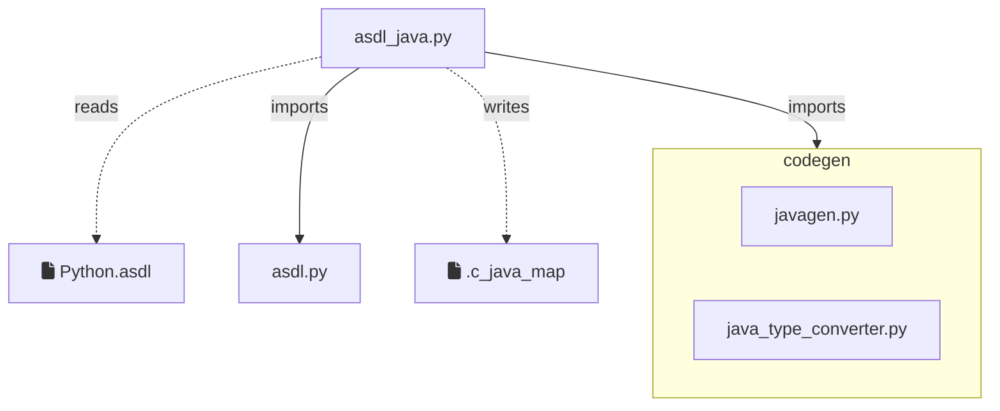
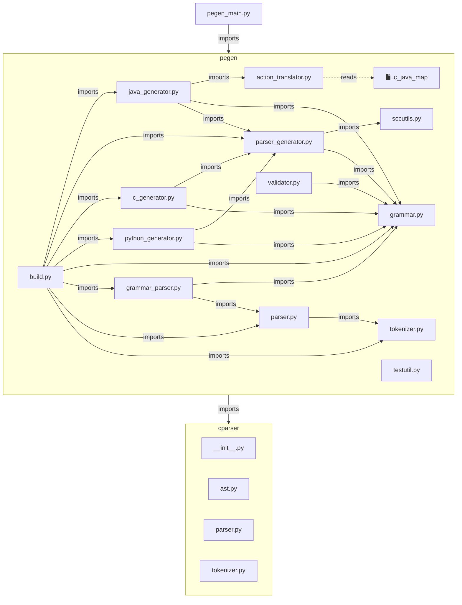

# A Survey of the Modules

Here is a little help to navigate the code.
We describe how it was in Pegen2. 
Currently, only some of this is present in the code base,
as we do not check in what we do not yet use.

## A Dependency Map

We show here what dependencies exist in the code as we add it.
`asdl_java` and `pegen_main.py` form two distinct hierarchies,
connected by data.

Exceptionally we include the generated `.c_java_map`
as it mediates a data dependency between the two diagrams.

## Copied, Modified and New Source

Pegen2 relies heavily on the PEG parser and ASDL processing code
that appear in the source repository of CPython
and are used for code generation in that build.
In order to create a parser in Java,
some new modules had to be created,
some of the exiting ones have been modified,
and some have been copied into place in this project unmodified.

We distinguish "true source" files from artefacts
intermediate between programs in the collection,
or the final parser.
It is useful to keep track of the status of each "true source" file.

Ideally we would not check in anything that is generated,
but at the time of writing some pragmatism is necessary.

| Location                 | File                   | CPython File          | CPython location          |
|--------------------------|------------------------|-----------------------|---------------------------|
| tools/python             | asdl_java.py           | ~ asdl_c.py           | Parser                    |
| tools/python             | Python.asdl            | = Python.asdl         | Parser                    |
| tools/python/lib         | asdl.py                | = asdl.py             | Parser                    |
| tools/python/codegen     | javagen.py             | -                     | -                         |
| tools/python/codegen     | java_type_converter.py | -                     | -                         |
| tools/python/lib/pegen   | command.py             | ~ \_\_main__.py       | Tools/peg_generator/pegen |
| tools/python/lib/pegen   | action_translator.py   | -                     | -                         |
| tools/python/lib/pegen   | build.py               | + build.py            | Tools/peg_generator/pegen |
| tools/python/lib/pegen   | c_generator.py         | = c_generator.py      | Tools/peg_generator/pegen |
| tools/python/lib/pegen   | grammar.py             | = grammar.py          | Tools/peg_generator/pegen |
| tools/python/lib/pegen   | grammar_parser.py      | = grammar_parser.py   | Tools/peg_generator/pegen |
| tools/python/lib/pegen   | java_generator.py      | ~ c_generator.py      | Tools/peg_generator/pegen |
| tools/python/lib/pegen   | parser.py              | = parser.py           | Tools/peg_generator/pegen |
| tools/python/lib/pegen   | parser_generator.py    | = parser_generator.py | Tools/peg_generator/pegen |
| tools/python/lib/pegen   | python_generator.py    | = python_generator.py | Tools/peg_generator/pegen |
| tools/python/lib/pegen   | sccutils.py            | = sccutils.py         | Tools/peg_generator/pegen |
| tools/python/lib/pegen   | testutil.py            | = testutil.py         | Tools/peg_generator/pegen |
| tools/python/lib/pegen   | tokenizer.py           | = tokenizer.py        | Tools/peg_generator/pegen |
| tools/python/lib/pegen   | validator.py           | = validator.py        | Tools/peg_generator/pegen |
| tools/python/lib/cparser | \_\_init__.py          | -                     | -                         |
| tools/python/lib/cparser | ast.py                 | -                     | -                         |
| tools/python/lib/cparser | parser.py              | -                     | -                         |
| tools/python/lib/cparser | tokenizer.py           | -                     | -                         |

In the "CPython File" column of this table, we use the symbols:

| Symbol | Meaning                                                 |
|--------|---------------------------------------------------------|
| =      | File is identical (apart from later changes in CPython) |
| +      | Makes Java-specific additions the CPython file          |
| ~      | New, but based on this CPython counterpart              |
| -      | Essentially new                                         |

This information will be helpful for merging changes from CPython into Pegen2.
Files marked "=" or "+" can be merged easily.
Files marked "~" will need careful inspection of the differences.

